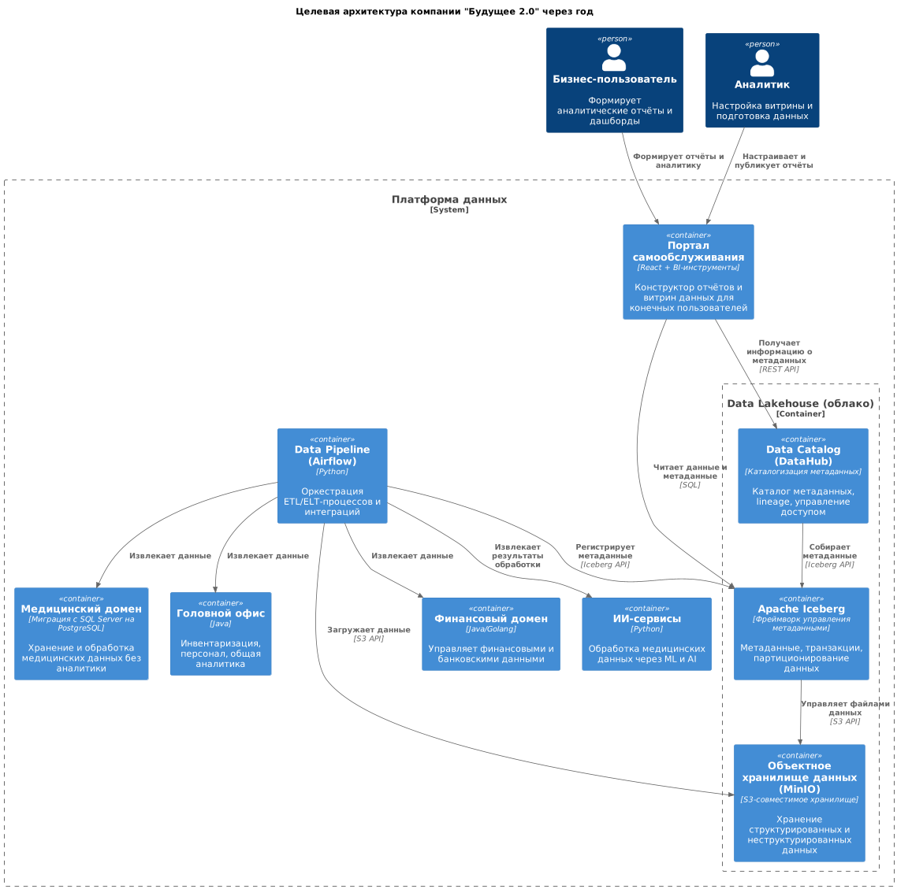

[назад](../README.md)

# Задание 1

## **1. Диаграмма контейнеров в модели C4**

Диаграмма показывает целевое состояние архитектуры компании "Будущее 2.0" через год с учётом планируемых изменений.

## **2. Анализ проблемных мест**

| № | Проблемное место                                       | Описание                                                                                | Влияние на бизнес                                                   |
|---|--------------------------------------------------------|-----------------------------------------------------------------------------------------|---------------------------------------------------------------------|
| 1 | Медленная генерация отчётов                            | Сложные отчёты выполняются долго из-за большого объёма и множества трансформаций данных | Снижение производительности сотрудников, задержки принятия решений  |
| 2 | Устаревшие технологии (SQL Server 2008, Power Builder) | Препятствуют масштабированию и интеграции новых данных, риск отказа и уязвимости        | Риски стабильности системы, сложности при интеграции новых бизнесов |
| 3 | Централизованная бизнес-логика в DWH                   | Любое изменение требует множества согласований, усложняет разработку                    | Увеличение time-to-market, дорогая разработка                       |
| 4 | Отсутствие гибкого самообслуживания для пользователей  | Пользователи не могут самостоятельно гибко конструировать отчёты и аналитику            | Снижение эффективности бизнес-пользователей, нагрузка на ИТ-отдел   |
| 5 | Устаревшая интеграционная шина (Apache Camel)          | Замедляет интеграцию и обработку потоковых данных, сложна в масштабировании             | Риски задержек и отказов при росте объёмов данных                   |

## **3. Приоритизация проблем (MoSCoW)**

| Приоритет | Проблема                           | Обоснование                                                             |
|-----------|------------------------------------|-------------------------------------------------------------------------|
| Must      | Медленная генерация отчётов        | Прямое влияние на бизнес, требуется срочное решение                     |
| Must      | Централизованная бизнес-логика DWH | Ключевой фактор снижения time-to-market и усложнения интеграций         |
| Must      | Устаревшие технологии              | Прямой риск безопасности и отказоустойчивости                           |
| Should    | Отсутствие самообслуживания        | Значительно улучшит эффективность пользователей и снизит нагрузку на IT |
| Could     | Устаревшая интеграционная шина     | Требует решения, но не критично в краткосрочной перспективе             |

[назад](../README.md)