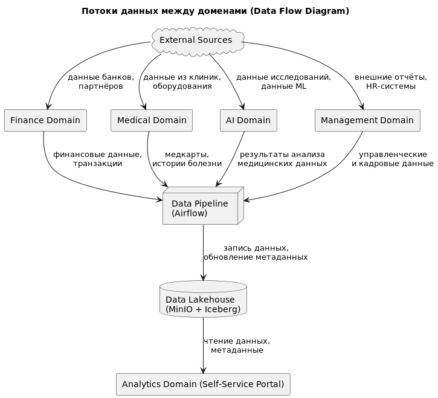

[назад](../README.md)

# Задание 2

## **1. Разделение на домены**

Предлагаемое разделение на домены с учётом подхода Data Mesh:

- **Финансовый домен (Finance Domain)**
  Управляет финансовыми и банковскими данными, кредитами, счетами и транзакциями.
- **Медицинский домен (Medical Domain)**
  Управляет медицинскими данными, медкартами и историей болезни (без аналитики).
- **ИИ-домен (AI Domain)**
  Управляет обработкой медицинских данных с использованием машинного обучения и ИИ.
- **Домен управления и персонала (Management Domain)**
  Информация о персонале, инвентаризации, управленческая и административная аналитика.
- **Аналитический домен (Analytics Domain)**
  Самообслуживание бизнес-пользователей, построение отчётов и аналитических решений.

## **2. Data Flow Diagram (DFD)**

Диаграмма показывает потоки данных между доменами в новой архитектуре:

## **3. Аргументация разделения на домены**

**Преимущества предлагаемого разделения на домены:**

| Преимущество                                 | Подробное описание для бизнеса                                                                                                                       |
|----------------------------------------------|------------------------------------------------------------------------------------------------------------------------------------------------------|
| **Независимость доменов**                    | Каждый домен развивается независимо, что значительно ускоряет разработку новых продуктов и сервисов, уменьшая time-to-market.                        |
| **Продуктовый подход к данным**              | Каждый домен владеет своими данными как отдельным продуктом, улучшая их качество и удобство для аналитиков и бизнес-пользователей.                   |
| **Ускорение интеграций**                     | Чёткое разделение облегчает интеграцию новых компаний и сервисов, минимизируя доработку центрального DWH.                                            |
| **Повышение масштабируемости**               | Архитектура доменов и Data Lakehouse позволяет легко масштабировать систему при росте бизнеса и объёма данных.                                       |
| **Повышение эффективности аналитики**        | Аналитический домен с порталом самообслуживания позволяет бизнес-пользователям формировать отчёты и аналитику без постоянного привлечения IT-отдела. |
| **Снижение рисков и повышение безопасности** | Каждый домен может отдельно реализовывать свои политики безопасности и управления доступами, что снижает общие риски.                                |
| **Гибкость бизнес-процессов**                | Новая архитектура позволяет проще адаптировать процессы и логику к быстро изменяющимся бизнес-требованиям.                                           |

[назад](../README.md)