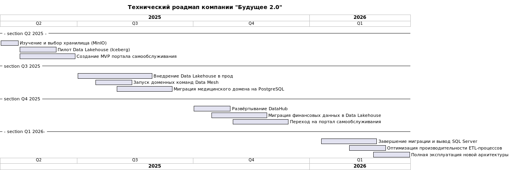

[назад](../README.md)

# Задание 3

## **1. Технический радар (табличный вид)**

| Квадрант               | Adopt (Активно используем)               | Trial (Пробуем)                        | Assess (Изучаем)                           | Hold (Выводим)            |
|------------------------|------------------------------------------|----------------------------------------|--------------------------------------------|---------------------------|
| **Языки и фреймворки** | Python, Java, Golang                     | React, FastAPI                         | Rust, Scala                                | Power Builder             |
| **Платформы**          | Kubernetes, PostgreSQL                   | MinIO (S3-совместимое хранилище)       | Yandex Object Storage, Ceph                | Microsoft SQL Server 2008 |
| **Инструменты**        | Airflow, Apache Camel                    | Apache Iceberg, DataHub (Data Catalog) | Apache Kafka, Great Expectations           | Устаревший ELT на SQL     |
| **Методы и паттерны**  | DDD (Domain Driven Design), Микросервисы | Data Mesh, Self-service Analytics      | Data Observability, GitOps, Data Contracts | Монолитная бизнес-логика  |

## **2. Технический роадмап (диаграмма Ганта)**

## **3. Обоснование изменений (табличный вид)**

| Этап роадмапа                                    | Обоснование и ожидаемый результат                                                                                                          |
|--------------------------------------------------|--------------------------------------------------------------------------------------------------------------------------------------------|
| **Изучение и выбор хранилища (MinIO)**           | Выбор решения, подходящего под требования масштабируемости, отказоустойчивости и интеграции с Data Lakehouse.                              |
| **Пилот Data Lakehouse (Iceberg)**               | Проверка нового подхода на небольшом объёме данных для подтверждения улучшения производительности и удобства работы.                       |
| **Создание MVP портала самообслуживания**        | Первичная реализация витрины данных для демонстрации ценности подхода бизнесу.                                                             |
| **Внедрение Data Lakehouse в прод**              | Переход на масштабируемое и удобное в управлении хранилище, снижение нагрузки на текущий DWH, улучшение производительности аналитики.      |
| **Запуск доменных команд Data Mesh**             | Формирование специализированных команд ускорит интеграции и позволит развивать бизнес-независимые домены.                                  |
| **Миграция медицинского домена на PostgreSQL**   | Снятие рисков, связанных с устаревшей версией SQL Server, улучшение производительности и поддержки медицинских данных.                     |
| **Развёртывание DataHub**                        | Централизованное управление метаданными, ускорение поиска и анализа данных, повышение прозрачности и качества данных.                      |
| **Миграция финансовых данных в Data Lakehouse**  | Снижение time-to-market для интеграции новых финансовых услуг, улучшение аналитики и отчётности.                                           |
| **Переход на портал самообслуживания**           | Повышение удобства работы аналитиков и бизнес-пользователей, снижение нагрузки на IT-отдел.                                                |
| **Завершение миграции и вывод SQL Server**       | Полный отказ от устаревших технологий снизит риски безопасности, повысит производительность и снизит издержки.                             |
| **Оптимизация производительности ETL-процессов** | Снижение затрат на обработку данных, повышение скорости получения отчётов и аналитики.                                                     |
| **Полная эксплуатация новой архитектуры**        | Достижение целевого состояния с максимально быстрыми отчётами, удобным самообслуживанием и минимальными затратами на поддержку и развитие. |

[назад](../README.md)